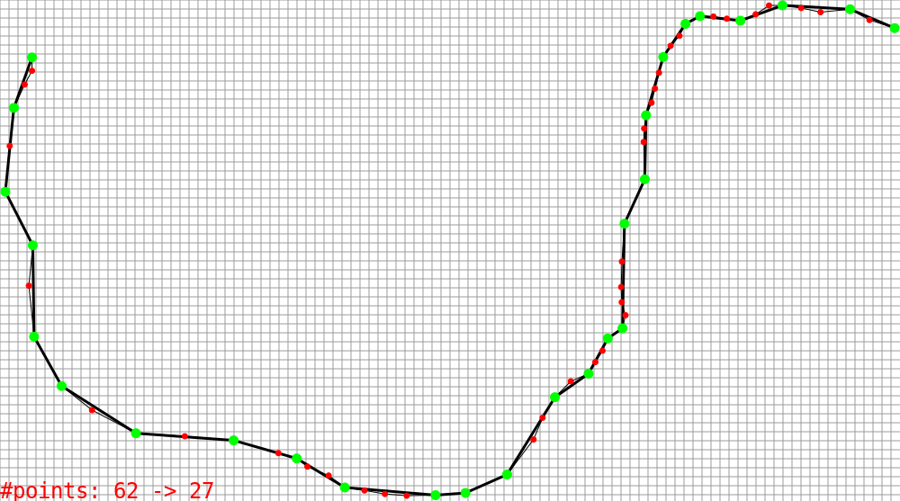
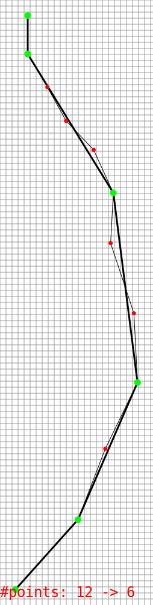

# naive-svg

naive SVG writer, python & c++ implementation (c++11, header only)

naive?

Yes. Only point (circle) + line (polyline) + text.

## C++

C++11 compiler is needed.

see <svg.hpp> for implementation. see <tests/test_douglas.cpp> for usage.

## Python

python 3, needs numpy.

For compatibility, no type annotation, no dataclass.

see <svg.py> for implementation.